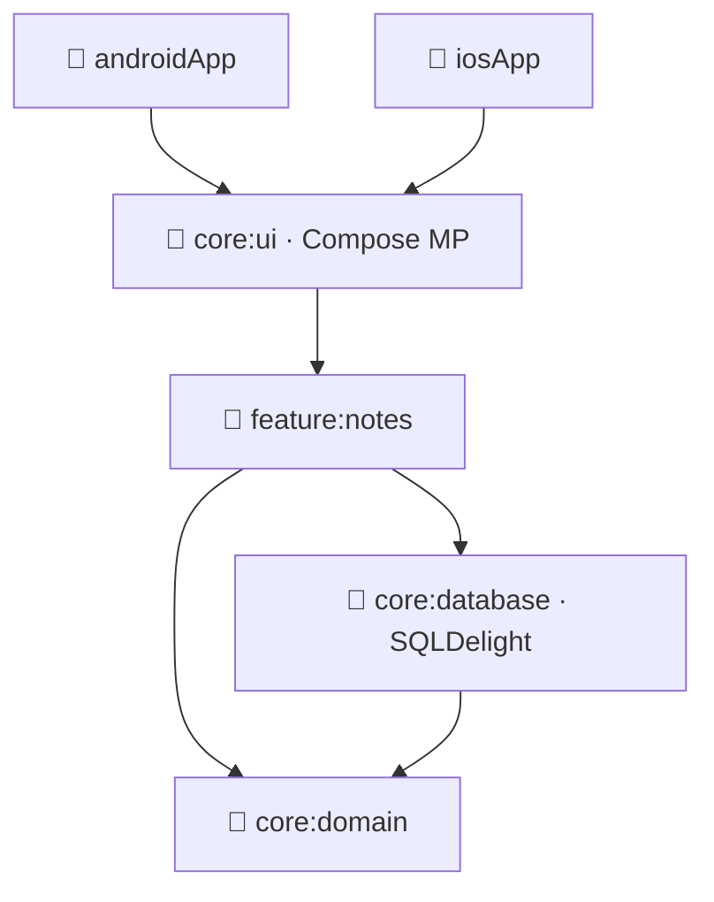

<div align="center">

# Nota

**A clean, modular notes app built with Kotlin Multiplatform & Compose Multiplatform — one shared codebase for Android and iOS.**


</div>

---

**Nota** is a notes app that demonstrates a production-style **Kotlin Multiplatform** architecture: a single shared core for domain, data, and UI, rendered with **Compose Multiplatform** on both Android and iOS. State, persistence, and dependency injection all live once in `commonMain`.

## ✨ Features

- **Shared UI** with Compose Multiplatform — one screen layer for Android and iOS.
- **Local persistence** via SQLDelight (type-safe SQL, multiplatform drivers).
- **Dependency injection** with Koin, including Compose ViewModel integration.
- **Reactive state** via Kotlin coroutines & Flow, with lifecycle-aware ViewModels.
- **Strict modularization** — clear boundaries between domain, database, UI, and feature.

## 🛠 Tech stack

| Layer | Technologies |
|---|---|
| UI | Compose Multiplatform · Navigation Compose |
| State / DI | Coroutines + Flow · Koin (core / compose / viewmodel) |
| Persistence | SQLDelight (android + native drivers) |
| Targets | Android · iOS |

## 🏗 Modules

```
Nota/
├── core/
│   ├── domain/      # models + business logic (pure Kotlin)
│   ├── database/    # SQLDelight schema + queries
│   └── ui/          # shared Compose design system
├── feature/
│   └── notes/       # notes feature: screens, state, wiring
├── androidApp/      # Android entry point
└── iosApp/          # iOS entry point (SwiftUI host)
```

## 🗺️ How it fits together



## 📸 Screenshots

> _Captures coming soon — drop them in `docs/screenshots/` and they'll render here._

| List | Editor | iOS |
|:---:|:---:|:---:|
| – | – | – |

## 🚀 Getting started

```bash
# Android
./gradlew :androidApp:installDebug

# iOS — open iosApp/ in Xcode and run (Kotlin framework builds via Gradle)
```

---

<div align="center"><sub>Built by <b>Ahmed Essam</b> · <a href="mailto:ahmedessamedeen@gmail.com">ahmedessamedeen@gmail.com</a> · <a href="https://github.com/ahmedessameldeen">@ahmedessameldeen</a></sub></div>
